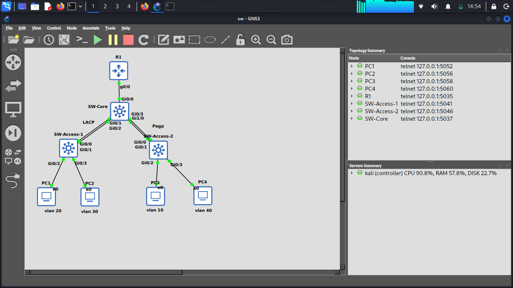

# Enterprise Switching & VLAN Lab (GNS3)

A comprehensive CCNA-level switching project covering VLANs, VTP, EtherChannel (LACP & PAgP), Router-on-a-Stick, DHCP, and Port Security.

## 🎯 Project Overview
Simulated a multi-switch enterprise network with VLAN segmentation, centralized VLAN management (VTP), EtherChannel redundancy, Inter-VLAN routing (ROAS), and Layer 2 security (Port Security).

## 🏗️ Network Topology

## 📊 VLAN & IP Scheme
| VLAN | Name | Subnet | Gateway |
|------|------|--------|---------|
| 10 | IT | 192.168.10.0/24 | 192.168.10.1 |
| 20 | Sales | 192.168.20.0/24 | 192.168.20.1 |
| 30 | HR | 192.168.30.0/24 | 192.168.30.1 |
| 40 | Servers | 192.168.40.0/24 | 192.168.40.1 |
| 99 | Management | 192.168.99.0/24 | 192.168.99.1 |

## 🛠️ Technologies Used
- **VLANs & 802.1Q Trunking**
- **VTP (Server/Client)** — Domain: `ccna`, Password: `123`
- **EtherChannel:** LACP (Core ↔ Access-1) & PAgP (Core ↔ Access-2)
- **Router-on-a-Stick (ROAS)** on R1
- **DHCP Server** on R1
- **Port Security** on Access Ports

## ⚙️ Configuration Guide
## ⚙️ Configuration Guide
Full configuration files are available in the [`config/`](config/) directory.
- [R1 Configuration](config/R1.txt)
- [SW-Core Configuration](config/SW-Core.txt)
- [SW-Access-1 Configuration](config/SW-Access-1.txt)
- [SW-Access-2 Configuration](config/SW-Access-2.txt)

## ✅ Verification
| Test | Command | Result |
|------|---------|--------|
| Inter-VLAN Ping | PC1 → PC3 | ✅ Success |
| DHCP Lease | `ip dhcp` on PC | ✅ Success |
| EtherChannel | `show etherchannel summary` | `Po1(SU)`, `Po2(SU)` |
| Port Security | `show port-security int gi0/3` | Violation Count: 3 |

## 📚 Lessons Learned
1. VTPام Revision Number risks and mitigation.
2. LACP vs PAgP configuration differences.
3. Importance of the `native` keyword in ROAS.
4. Port Security sticky MAC and violation modes.

## 👤 Author
**Armin Isa** — [github.com/arminisa](https://github.com/arminisa)
